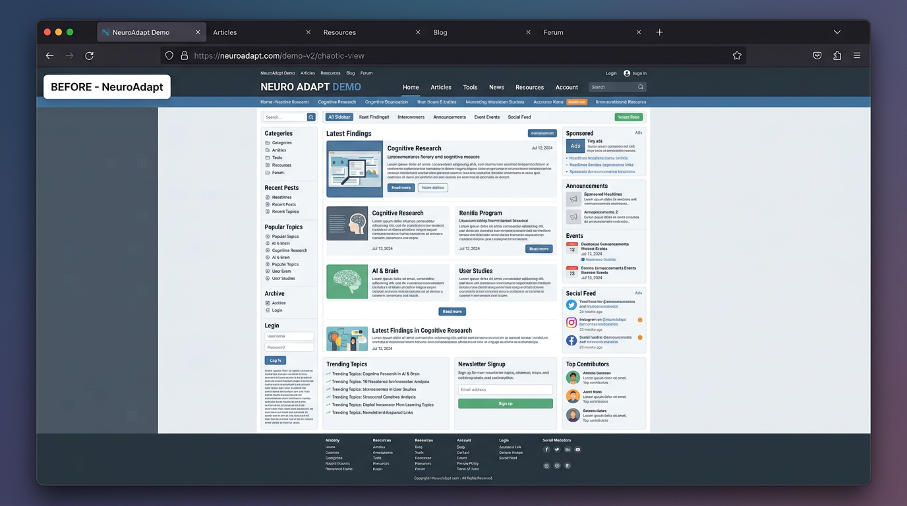
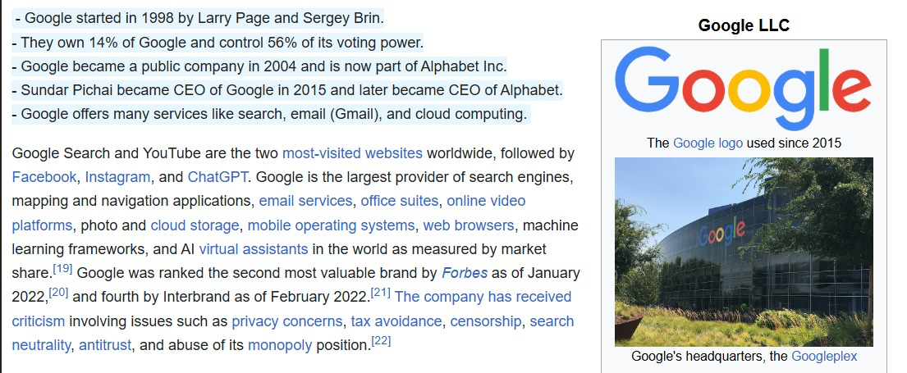
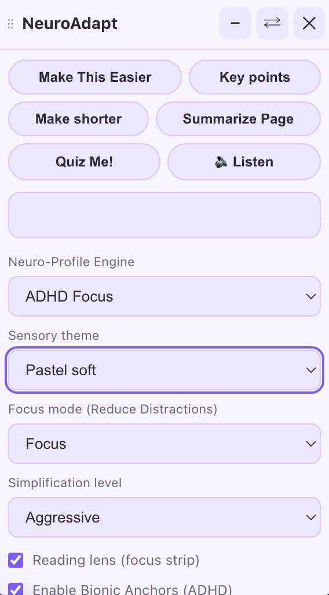
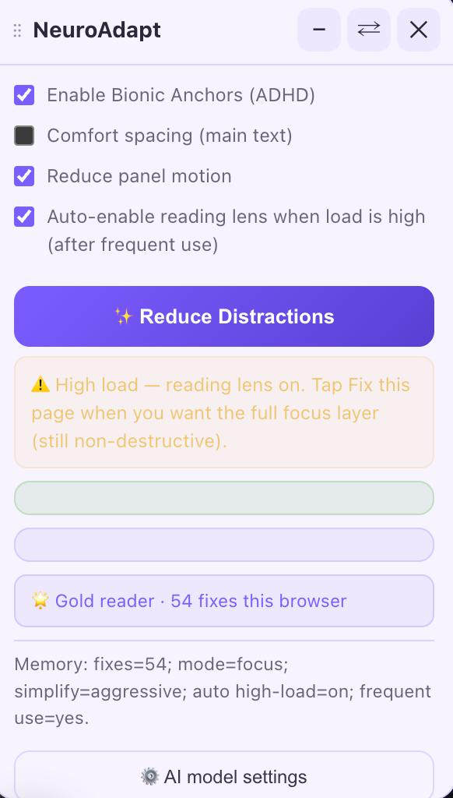

# NeuroAdapt

> **An intelligent cognitive accessibility engine that dynamically restructures, simplifies, and optimizes web content to create a neuro-inclusive browsing experience.**

---

## 🖼️ Visual Demo

### Before & After NeuroAdapt
*Watch how NeuroAdapt dynamically removes distractions, structures the document, and replaces dense text blocks with simple, readable formatting.*

| **Before NeuroAdapt** | **After NeuroAdapt** |
| :---: | :---: |
|  |  |

### Extension Interface
*Our clean, intuitive interface allows users to control sensory themes, toggle bionic reading, and dynamically request AI simplifications.*

| **Main Controls & Summaries** | **Sensory & Spacing Options** |
| :---: | :---: |
|  |  |

---

## 📖 Overview

**NeuroAdapt** is a robust browser extension designed to natively adapt web pages for individuals with varying cognitive loads, neurodivergent conditions (like ADHD or Dyslexia), or simply those experiencing digital fatigue. 

Unlike standard text-to-speech or simple contrast-ratio extensions, NeuroAdapt deeply analyzes the DOM and text complexity. It computes a localized cognitive load score using feature-based heuristics and intelligently steps in with powerful layout alterations and LLM-backed simplification to reduce friction.

## ✨ Core Features

* **Cognitive Load Analysis**: Automatically evaluates page complexity using DOM density, average words per sentence, and continuous dense block counts.
* **LLM Content Simplification**: Securely delegates highly complex paragraphs to large language models. It replaces dense technical jargon with approachable, neuro-inclusive language.
* **Persistent Preferences**: Any changes you make to your **Sensory Theme**, **Neuro-Profile Engine**, or **Focus Mode** are securely saved and remembered across your browsing sessions!
* **Intelligent Layout Focus**: Dynamically dims navigational chrome, removes intrusive popups dynamically based on z-index heuristics, and isolates the central `<main>` reading container.
* **Bionic Anchors & Spacing**: Employs evidence-based bionic reading patterns and comfort spacing to guide visual tracking and reduce eye strain.

---

## 🚀 How to Run the Project (Detailed Step-by-Step)

NeuroAdapt is a native browser extension. You **do not** need to install Node.js, Python, or run any terminal commands to build this application.

Follow these explicit steps to load the extension into your system for judging:

### Step 1: Download & Extract the Code
1. Clone this repository or download the `.zip` file from the project page.
2. Unzip the file onto your Desktop or Documents folder. You should see a top-level directory containing the `extension/` folder.

### Step 2: Open Extension Settings in Chrome / Edge
1. Open up your Chromium-based web browser (Google Chrome, Microsoft Edge, Brave).
2. Type `chrome://extensions/` into your top URL address bar and press **Enter** (If using Edge, type `edge://extensions/`).

### Step 3: Enable Developer Mode
1. Look at the top right corner of the Extensions page.
2. Ensure the toggle switch for **Developer mode** is turned **ON**.

### Step 4: Load the Unpacked Extension
1. Once Developer mode is activated, a new menu bar will appear at the top left of the page.
2. Click the button that says **Load unpacked**.
3. A file browser window will appear. Navigate to the folder you unzipped in Step 1.
4. Select the **`extension/` folder** specifically (make sure you pick the folder that contains the `manifest.json` file inside it) and click **Select Folder**.
5. NeuroAdapt will instantly install and appear in your list of extensions!

### Step 5: 📌 Pin the Extension (Crucial Step!)
To use NeuroAdapt easily, you must pin it:
1. Click the **puzzle-piece** "Extensions" icon in the top right of your browser toolbar.
2. Scroll to find **NeuroAdapt**.
3. **Click the Pin icon** next to it so it stays permanently pinned to your toolbar!

### Step 6: Acquiring & Saving Your API Key (Core Step!)
To power the AI simplification features, you need an API key. We support OpenAI, Anthropic, or OpenRouter!
1. **Get a Key:** For example, go to [OpenRouter.ai](https://openrouter.ai/), create an account, and generate an API key. OpenRouter is highly recommended because it gives access to cheap and fast models!
2. **Open Extension Options:** Click the puzzle-piece icon in your browser, click the three dots next to NeuroAdapt, and select **Options**. (Alternatively, go to `chrome://extensions/`, click **Details** under NeuroAdapt, and select **Extension options**). This will open the settings page where you can fill in your API key.
3. **Add Your Key & Version:** 
   - If using OpenRouter, select the **Custom** provider from the dropdown. 
   - Look for the **Base URL (custom only)** text field and type exactly: `https://openrouter.ai/api/v1`
   - Look for the **API key** password field and paste your private API key directly into it.
   - For the **Model** text field, enter your chosen OpenRouter model string (e.g., `openai/gpt-4o-mini` or `anthropic/claude-3-haiku`).
   *(Note: All API keys are stored 100% locally and securely inside your browser.)*
4. **Saved Automatically:** Click **Save**. Note that any visual UI personalizations you make later in the pop-up (like Neuro-Profiles or Themes) are also instantly saved locally and persist as you navigate!

### Step 7: Test it Out!
1. Go to any text-heavy article (like Wikipedia).
2. Click the NeuroAdapt puzzle icon to inject the custom UI onto your screen.
3. Test out **Reduce Distractions**, Sensory Profiles, and **Make This Easier** to witness the AI simplification!

---

## 🏗 System Architecture

```text
NeuroAdapt/
├── extension/
│   ├── manifest.json       # Extension configurations and permission scopes
│   ├── service-worker.js   # Background secure LLM communication & state
│   ├── options.html        # Secure key and backend configuration UI
│   ├── options.js          # Controller for options.html
│   ├── content.js          # DOM heuristics, simplification engines & UI injection
│   └── styles.css          # Injected focus-mode styling and component definitions
├── demo/                   # Demo imagery for the README
└── README.md
```

---
